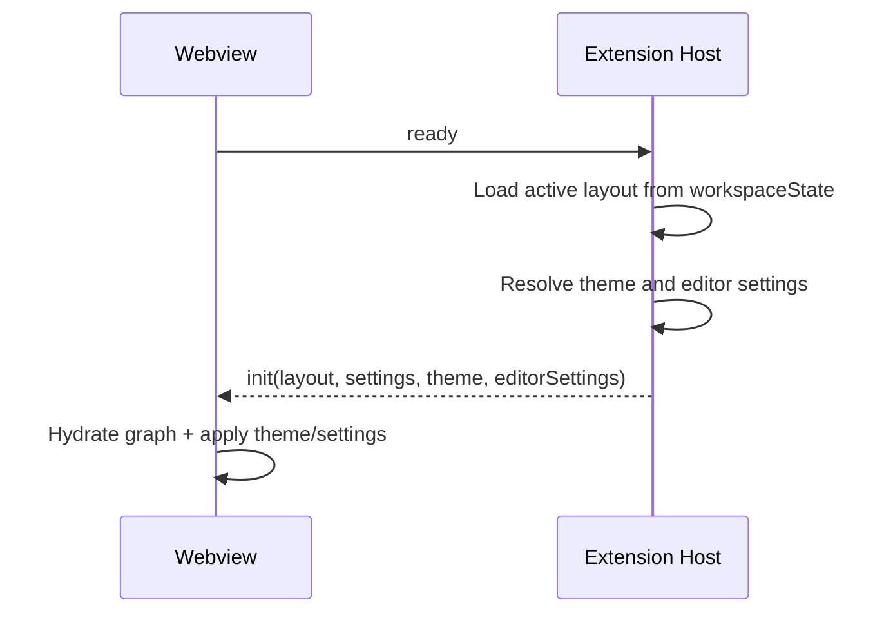
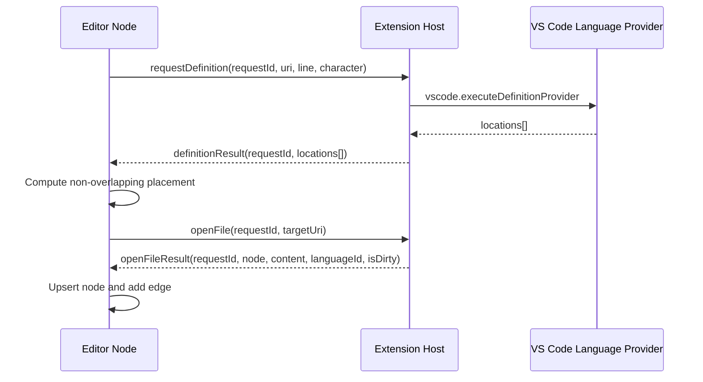
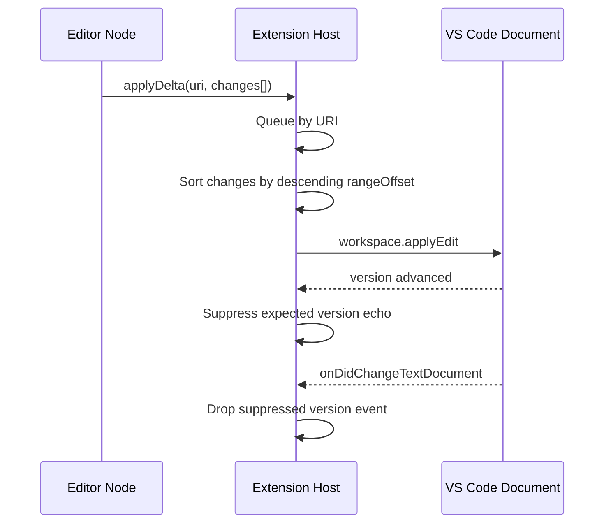

# Introduction

This specification defines the complete behavior, interfaces, constraints, and validation criteria for the Wanderer Visual Studio Code extension. The extension provides a spatial code-navigation experience with a canvas-based editor surface, bidirectional synchronization with workspace documents, and language-service integration through the VS Code extension host.

The document is normative unless explicitly marked as guideline or recommendation.

## 1. Purpose & Scope

This specification exists to provide a single, unambiguous reference for implementation, maintenance, quality assurance, and future extension of Wanderer.

Scope includes:

- Extension host runtime behavior.
- Webview runtime behavior.
- Shared protocol and data contracts.
- Language service proxy behavior.
- Document synchronization semantics.
- Layout persistence and named layouts.
- Theme and editor-setting forwarding.
- Diagnostics forwarding.
- User commands and UI interactions.
- Security controls in the webview host integration.
- Build, packaging, and compatibility constraints.

Scope excludes:

- Marketplace publication workflow.
- Cloud services or remote backend systems.
- Multi-user collaborative editing.

Intended audience:

- Extension engineers.
- Frontend engineers working in the webview runtime.
- QA and test automation engineers.
- Technical reviewers preparing architecture or change proposals.

Assumptions:

- Runtime host is VS Code with API compatibility to engine range declared by the extension.
- Workspace files are accessible through VS Code document APIs.
- Language servers/providers are available per language as configured in the user environment.

## 2. Definitions

- API: Application Programming Interface.
- CSP: Content Security Policy.
- URI: Uniform Resource Identifier.
- LSP: Language Server Protocol.
- Monaco: Monaco Editor runtime used inside the webview.
- Extension Host: Node-based VS Code extension process.
- Webview: Browser-like isolated UI surface hosted by VS Code.
- Canvas: Infinite surface where file nodes are rendered and moved.
- Node: Visual card representing a source file and Monaco editor model.
- Edge: Visual relation between nodes, typically definition/reference/manual.
- Camera: Canvas viewport coordinates and zoom.
- Active Layout: Auto-saved graph snapshot stored in workspace state.
- Named Layout: User-saved snapshot identified by a unique name.
- Dirty Buffer: File content changed but not persisted to disk.
- Suppressed Version: Expected document version ignored by sync to prevent echo loops.
- Host Sync: Synchronization operation between webview model and extension host document.

## 3. Requirements, Constraints & Guidelines

### 3.1 Functional Requirements

- REQ-001: The extension shall register an activity bar container with id wanderer and a sidebar webview view with id wanderer.sidebarCanvas.
- REQ-002: The extension shall register a tree view with id wanderer.savedLayouts for named layout management.
- REQ-003: The extension shall expose command wanderer.openCanvas that opens a singleton canvas panel.
- REQ-004: If the canvas panel already exists, openCanvas shall reveal the existing panel instead of creating a duplicate.
- REQ-005: The extension shall expose command wanderer.openCurrentFileOnCanvas and open the active editor document as a node when available.
- REQ-006: If openCurrentFileOnCanvas is invoked without an active editor, the extension shall show an informational message and perform no node creation.
- REQ-007: The extension shall expose command wanderer.revealDefinition and open definition targets of the active cursor selection on the canvas.
- REQ-008: When no definitions are found for revealDefinition, the extension shall provide user feedback and not create nodes.
- REQ-009: The extension shall expose command wanderer.zoomToFit and forward command intent to the webview.
- REQ-010: The extension shall expose command wanderer.saveLayout and require a non-empty layout name for named saves.
- REQ-011: Named layout save shall overwrite existing layout with same name.
- REQ-012: The extension shall expose commands wanderer.loadLayout, wanderer.renameLayout, and wanderer.deleteLayout for named-layout lifecycle.
- REQ-013: Deleting a named layout shall require explicit user confirmation.
- REQ-014: The extension shall expose command wanderer.resetLayout to clear only the active auto-save layout key.
- REQ-015: The extension host shall initialize and send an init message containing layout, canvas settings, theme, and editor settings once webview readiness is confirmed.
- REQ-016: The webview shall send ready as handshake signal before expecting initialization payload.
- REQ-017: The webview shall support opening arbitrary files from a host-provided quick-pick dialog.
- REQ-018: The webview shall support requesting named-layout save through host prompt flow.
- REQ-019: The webview shall render editor nodes with draggable headers and close/open-in-workbench actions.
- REQ-020: Node close action shall remove the node and all incident edges from graph state.
- REQ-021: Definition navigation initiated from node editor shall request locations via host and place target nodes spatially adjacent.
- REQ-022: If a target file already exists on canvas, definition navigation shall focus the existing node and optionally connect edge rather than duplicating node.
- REQ-023: Node resizing shall support north, south, east, west, and diagonal handles.
- REQ-024: Node resizing shall enforce minimum dimensions width 280 and height 160.
- REQ-025: Canvas shall provide minimap and controls using React Flow primitives.
- REQ-026: Canvas shall capture viewport movement and persist camera state for snapshots.
- REQ-027: Canvas layout shall auto-save with debounce of approximately 500 ms on graph changes.
- REQ-028: Auto-save snapshot shall include dirty editor buffers when available.
- REQ-029: On layout restore, dirty buffers shall override host file content in local model and mark pending host synchronization.
- REQ-030: Layout restore with dirty buffers shall trigger host full-text apply to reconcile host document state before continuing delta sync.
- REQ-031: Webview shall display dirty indicator in node header when corresponding document is dirty.
- REQ-032: Webview shall request explicit document save on Cmd/Ctrl+S while editor has focus.
- REQ-033: Host shall process requestSaveDocument by saving document after pending edit queue completion.
- REQ-034: Host shall proxy hover, completion, and format requests through VS Code command API.
- REQ-035: Host shall forward diagnostics updates only for tracked documents.
- REQ-036: Webview shall apply diagnostics as Monaco markers for matching model URI.

### 3.2 Synchronization Requirements

- REQ-037: Document changes from host to webview shall be sent through documentChanged messages with content, version, and isDirty.
- REQ-038: Webview edits shall be sent as applyDelta with ordered change segments from Monaco change event.
- REQ-039: Host shall serialize inbound delta application per document URI.
- REQ-040: Host shall apply delta edits in descending rangeOffset order to prevent offset drift.
- REQ-041: Host shall suppress echo updates by registering expected version before workspace.applyEdit.
- REQ-042: If applyEdit fails, suppression entry shall be removed.
- REQ-043: Full-text applyEdit shall be used for explicit full-sync operations.
- REQ-044: Host shall watch tracked documents for both onDidChangeTextDocument and onDidSaveTextDocument.
- REQ-045: Save events shall also emit documentChanged so dirty indicator clears after save.

### 3.3 Protocol and State Requirements

- REQ-046: Shared protocol types shall be maintained in a single source file consumed by host and webview.
- REQ-047: All protocol messages shall include type discriminator and type-specific payload.
- REQ-048: Request/response interactions requiring correlation shall include requestId.
- REQ-049: Graph snapshot shall include nodes, edges, and camera and may include optional buffers map.
- REQ-050: Canvas settings shall include horizontalGap, verticalStack, defaultWidth, and defaultHeight.
- REQ-051: Host shall read canvas settings from extension configuration namespace wanderer.
- REQ-052: Host shall read editor settings from editor namespace and forward subset contract.
- REQ-053: Webview shall apply forwarded editor settings via centralized merged configuration store.
- REQ-054: Webview shall apply forwarded theme data via configuration service using workbench.colorTheme and token/UI overrides.

### 3.4 Error Handling and Resilience Requirements

- REQ-055: Unhandled errors in host message dispatch shall be captured and returned as error message with optional requestId.
- REQ-056: Webview language-provider requests shall time out after bounded interval and return graceful empty results.
- REQ-057: If webview dist bundle is not present, host shall render fallback HTML with build instructions.
- REQ-058: open dialog discovery shall attempt git listing first and fallback to workspace.findFiles if git fails.
- REQ-059: Theme resolution shall fallback to base theme when concrete contribution cannot be resolved.
- REQ-060: Config store updates shall merge and flush debounced to avoid destructive overwrite races.

### 3.5 Security Requirements

- SEC-001: Webview CSP shall default to none for all sources and explicitly allow only required source classes.
- SEC-002: Script execution shall be nonce-based.
- SEC-003: Webview local resource roots shall be restricted to webview dist folder.
- SEC-004: Host shall not execute arbitrary code from webview messages.
- SEC-005: Host shall use VS Code URI/document APIs for file access where possible.
- SEC-006: Open-dialog file enumeration shall respect git ignore rules when git mode is used.
- SEC-007: All host-to-webview and webview-to-host contracts shall remain typed and version-coherent through shared protocol definitions.

### 3.6 Constraints

- CON-001: Extension target runtime is Node 18-compatible bundle and CommonJS output.
- CON-002: Extension TypeScript compile target is ES2022 with strict type checking enabled.
- CON-003: Webview build target is ES2022 and must support VS Code webview runtime constraints.
- CON-004: React Flow is used as graph and viewport engine.
- CON-005: Monaco runtime is initialized via @codingame monaco-vscode service overrides.
- CON-006: Embedded Monaco workbench runtime shall disable external extension activation.
- CON-007: Monaco fixedOverflowWidgets shall remain false to avoid transformed-viewport widget drift.
- CON-008: Dirty-buffer persistence in graph snapshot is optional and only required for dirty files.
- CON-009: Named layouts are stored in workspaceState and therefore scoped to workspace context.
- CON-010: requestId generation is probabilistic string composition and not cryptographic identity.
- CON-011: Current pan-mode key behavior is implemented via Meta/Ctrl state despite UI comment text indicating Alt/Option.

### 3.7 Guidelines

- GUD-001: Protocol evolution should remain backward compatible for at least one extension/webview version boundary.
- GUD-002: New request/response message pairs should always include requestId.
- GUD-003: Message handlers should remain single-purpose and mapped in centralized dispatch tables.
- GUD-004: Data that affects rendering performance should be normalized and cached by URI where feasible.
- GUD-005: Graph placement algorithms should avoid overlap by default and remain deterministic for same input set.
- GUD-006: User-visible actions should provide informative feedback when operation cannot proceed.
- GUD-007: Theme and editor setting updates should be applied centrally rather than per-editor prop patching.
- GUD-008: Any save-path changes should preserve dirty indicator correctness.

### 3.8 Patterns

- PAT-001: Singleton panel pattern for canvas webview panel instance.
- PAT-002: Typed message-bus pattern with discriminated unions.
- PAT-003: Event-suppression pattern for echo-loop prevention in host document sync.
- PAT-004: Per-resource serialization queue for deterministic asynchronous edit application.
- PAT-005: Shared model cache pattern for Monaco buffer coherence across repeated file nodes.
- PAT-006: Optimistic UI placement with eventual host-backed content resolution.

## 4. Interfaces & Data Contracts

### 4.1 VS Code Commands

| Command ID                       | Source         | Description                                  | Inputs                   | Output/Effect             |
| -------------------------------- | -------------- | -------------------------------------------- | ------------------------ | ------------------------- |
| wanderer.openCanvas              | Extension      | Open or reveal singleton canvas panel        | None                     | Panel shown               |
| wanderer.openCurrentFileOnCanvas | Extension      | Add active file node                         | Active editor context    | Node opened near center   |
| wanderer.revealDefinition        | Extension      | Resolve definition from active editor cursor | Active editor context    | Target node(s) opened     |
| wanderer.zoomToFit               | Extension      | Trigger fit-view command in canvas           | None                     | Viewport fit animation    |
| wanderer.saveLayout              | Extension      | Prompt name and save named snapshot          | Name string              | Named layout persisted    |
| wanderer.loadLayout              | Extension/Tree | Load named snapshot                          | Name or tree item        | Canvas hydrated           |
| wanderer.renameLayout            | Extension/Tree | Rename named snapshot                        | Tree item + new name     | Named layout renamed      |
| wanderer.deleteLayout            | Extension/Tree | Delete named snapshot                        | Tree item + confirmation | Named layout removed      |
| wanderer.resetLayout             | Extension      | Remove active auto-saved snapshot            | None                     | Active layout key cleared |

### 4.2 Configuration Contract

| Setting Key                    | Type   | Default | Purpose                                                  |
| ------------------------------ | ------ | ------- | -------------------------------------------------------- |
| wanderer.spatial.horizontalGap | number | 120     | Horizontal placement gap between source and target nodes |
| wanderer.spatial.verticalStack | number | 40      | Vertical stacking offset for multiple targets            |
| wanderer.node.defaultWidth     | number | 520     | Default node width                                       |
| wanderer.node.defaultHeight    | number | 360     | Default node height                                      |

### 4.3 View Contributions

| Contribution           | ID                     | Type           | Behavior                                              |
| ---------------------- | ---------------------- | -------------- | ----------------------------------------------------- |
| Activity Bar Container | wanderer               | viewsContainer | Hosts Wanderer views                                  |
| Sidebar Webview        | wanderer.sidebarCanvas | webview        | Launcher for opening panel and active file            |
| Layout Tree            | wanderer.savedLayouts  | tree           | Lists named snapshots with load/rename/delete actions |

### 4.4 Shared Data Types

```ts
interface RangeLike {
  startLine: number;
  startCharacter: number;
  endLine: number;
  endCharacter: number;
}

interface CanvasNode {
  id: string;
  fileUri: string;
  x: number;
  y: number;
  width: number;
  height: number;
  revealRange?: RangeLike;
}

interface CanvasEdge {
  id: string;
  source: string;
  target: string;
  type: "definition" | "reference" | "manual";
}

interface GraphSnapshot {
  nodes: CanvasNode[];
  edges: CanvasEdge[];
  camera: { x: number; y: number; zoom: number };
  buffers?: Record<
    string,
    { content: string; languageId: string; isDirty: boolean }
  >;
}
```

### 4.5 Extension to Webview Messages

| Type                  | Required Fields                               | Semantics                                                      |
| --------------------- | --------------------------------------------- | -------------------------------------------------------------- |
| init                  | layout, settings, theme, editorSettings       | Initial hydration and configuration payload after ready        |
| openFileResult        | requestId, node, content, languageId, isDirty | File-open response payload                                     |
| definitionResult      | requestId, sourceNodeId, locations[]          | Definition lookup response                                     |
| referencesResult      | requestId, sourceNodeId, locations[]          | Reference lookup response                                      |
| documentChanged       | uri, content, version, isDirty                | Host document state update                                     |
| themeChanged          | theme                                         | Active theme changed                                           |
| editorSettingsChanged | editorSettings                                | Active editor settings changed                                 |
| command               | command                                       | Imperative host command, currently zoomToFit/requestSaveLayout |
| hoverResult           | requestId, contents[]                         | Hover response                                                 |
| completionResult      | requestId, items[]                            | Completion response                                            |
| formatResult          | requestId, edits[]                            | Format response                                                |
| diagnostics           | uri, markers[]                                | Diagnostics marker payload                                     |
| error                 | message, requestId?                           | Error signal for request or generic dispatch failure           |

### 4.6 Webview to Extension Messages

| Type                   | Required Fields                                   | Semantics                        |
| ---------------------- | ------------------------------------------------- | -------------------------------- |
| ready                  | none                                              | Webview handshake signal         |
| openFile               | requestId, fileUri, placement?, revealRange?      | Request file node payload        |
| requestDefinition      | requestId, sourceNodeId, fileUri, line, character | Request definitions              |
| requestReferences      | requestId, sourceNodeId, fileUri, line, character | Request references               |
| applyEdit              | uri, text, version                                | Full-text edit apply             |
| applyDelta             | uri, changes[], version                           | Incremental edit apply           |
| saveLayout             | snapshot                                          | Persist active layout snapshot   |
| revealInWorkbench      | fileUri, range?                                   | Open file in native editor       |
| log                    | level, message                                    | Webview log forwarding           |
| requestOpenDialog      | none                                              | Ask host to show file picker     |
| requestSaveNamedLayout | none                                              | Ask host to prompt name and save |
| requestHover           | requestId, fileUri, line, character               | Request hover data               |
| requestCompletion      | requestId, fileUri, line, character               | Request completion data          |
| requestFormat          | requestId, fileUri                                | Request formatting edits         |
| requestSaveDocument    | fileUri                                           | Ask host to save document        |

### 4.7 Persistence Keys

| Key                   | Store          | Type          | Description              |
| --------------------- | -------------- | ------------- | ------------------------ |
| wanderer.layout       | workspaceState | GraphSnapshot | Auto-saved active layout |
| wanderer.savedLayouts | workspaceState | SavedLayout[] | Named saved layouts      |

SavedLayout contract:

```ts
interface SavedLayout {
  name: string;
  snapshot: GraphSnapshot;
  savedAt: number;
}
```

### 4.8 Key Behavioral Sequences

#### 4.8.1 Startup and Initialization



#### 4.8.2 Definition Navigation from Node Editor



#### 4.8.3 Incremental Edit Synchronization



## 5. Acceptance Criteria

- AC-001: Given the extension is activated, when user executes wanderer.openCanvas, then exactly one canvas panel is created and shown.
- AC-002: Given a panel already exists, when wanderer.openCanvas is executed again, then the existing panel is revealed and no second panel is created.
- AC-003: Given an active editor exists, when wanderer.openCurrentFileOnCanvas is executed, then a node with matching URI is opened on the canvas.
- AC-004: Given no active editor exists, when openCurrentFileOnCanvas is executed, then the extension displays an informational message and no node is opened.
- AC-005: Given webview has sent ready, when host dispatches init, then webview hydrates snapshot and applies settings/theme without runtime errors.
- AC-006: Given node editor content changes, when Monaco emits changes, then webview sends applyDelta and host applies edits in deterministic order.
- AC-007: Given host applies a webview edit, when onDidChangeTextDocument fires for suppressed version, then no echo documentChanged is emitted back.
- AC-008: Given a tracked document is saved, when onDidSaveTextDocument fires, then host sends documentChanged with isDirty false.
- AC-009: Given user Cmd/Ctrl-clicks symbol in node editor, when definitions exist, then target node(s) are opened or focused and linked by definition edge.
- AC-010: Given target file already exists on canvas, when definition result contains that URI, then existing node is focused and duplicate node is not created.
- AC-011: Given user resizes node below minimum bounds, when drag ends, then final size is clamped to minimum width and height.
- AC-012: Given user invokes Save Layout and provides valid name, when snapshot request returns, then named layout is persisted with current graph and timestamp.
- AC-013: Given user renames layout to existing name, when rename executes, then operation fails and warning is shown.
- AC-014: Given user confirms layout deletion, when delete executes, then layout is removed from named layout list.
- AC-015: Given diagnostics update for tracked URI arrives, when message is processed, then Monaco markers are updated on corresponding model.
- AC-016: Given hover/completion request times out, when timeout threshold is reached, then provider returns empty result without blocking editor interaction.
- AC-017: Given webview bundle is missing, when panel HTML is rendered, then fallback HTML with build instruction is shown.
- AC-018: Given theme change occurs in VS Code, when theme service resolves new theme data, then webview receives themeChanged and applies new visual tokens/colors.
- AC-019: Given editor settings change in VS Code, when host detects configuration change, then webview receives editorSettingsChanged and applies merged config.
- AC-020: Given requestSaveDocument is sent for dirty file, when host save succeeds, then subsequent documentChanged reflects clean state.

## 6. Test Automation Strategy

- Test Levels: Unit, Integration, End-to-End, Regression.
- Frameworks: Vitest for pure TypeScript modules, React Testing Library for webview component behavior, @vscode/test-electron for extension integration, Playwright (or equivalent) for end-to-end panel interaction scenarios.
- Test Data Management: Use temporary workspace fixtures with representative TypeScript, JSON, Markdown, and Python files; isolate fixture per test; tear down temporary workspace after run.
- CI/CD Integration: Run typecheck and tests in pull-request pipeline; run integration and E2E suites in scheduled and release candidate workflows.
- Coverage Requirements: Minimum 85 percent line coverage for pure logic modules; minimum 75 percent branch coverage for placement and sync logic; integration coverage required for command registration and protocol handshake.
- Performance Testing: Include scripted benchmark for opening 50 nodes, running 500 delta edits across 10 files, and measuring response times and memory growth.

Required automated test suites:

- TST-001: Command registration and activation smoke test.
- TST-002: Protocol handshake and init payload contract test.
- TST-003: DocumentSync suppression and delta ordering deterministic test.
- TST-004: Graph placement overlap-avoidance test.
- TST-005: Dirty-buffer snapshot/restore reconciliation test.
- TST-006: Theme and editor settings propagation test.
- TST-007: Diagnostics forwarding and marker application test.
- TST-008: Named layout CRUD integration test.
- TST-009: Save shortcut interception and host save confirmation test.
- TST-010: Webview fallback HTML test when dist bundle missing.

## 7. Rationale & Context

The architecture separates concerns into two execution domains:

- Extension host: trusted runtime with direct VS Code APIs, language providers, and workspace state access.
- Webview: interactive, high-frequency UI runtime with canvas rendering and Monaco editing.

This split enables:

- Strong integration with VS Code language ecosystem without re-implementing language intelligence.
- Smooth canvas interactivity using browser rendering primitives.
- Clear typed message contracts for maintainability and evolution.

Major design rationale:

- Shared protocol file reduces drift and runtime mismatch risks.
- Singleton panel avoids state fragmentation and duplicate synchronization channels.
- URI-scoped edit queues and suppression prevent race conditions and echo loops.
- Dirty-buffer persistence preserves user work-in-progress during layout restores.
- Centralized configuration merge avoids accidental overwrite in monaco-vscode config service.
- Theme service resolves real workbench contribution files for high-fidelity token and UI mapping.

Known trade-offs:

- Runtime message schema validation is compile-time only; malformed messages can still arrive at runtime.
- requestId generation prioritizes simplicity over cryptographic uniqueness.
- Hover/completion request timeout is fixed and may truncate slow language providers.
- Pan-mode key semantics currently differ from comment wording and should be aligned in a future revision.

## 8. Dependencies & External Integrations

### External Systems

- EXT-001: VS Code Extension API - command registration, webview hosting, document APIs, diagnostics events, configuration APIs.
- EXT-002: VS Code language provider command surface - definition, reference, hover, completion, and format provider execution.

### Third-Party Services

- SVC-001: No remote third-party network services are required for core extension functionality.

### Infrastructure Dependencies

- INF-001: Local workspace filesystem access through VS Code document and URI services.
- INF-002: Optional local git CLI availability for fast file enumeration in open-file picker.
- INF-003: Node-compatible extension host runtime for bundled extension entrypoint execution.

### Data Dependencies

- DAT-001: Workspace text documents, language identifiers, and diagnostics streams.
- DAT-002: WorkspaceState storage for active and named graph snapshots.

### Technology Platform Dependencies

- PLT-001: Visual Studio Code API compatibility with extension engine declaration.
- PLT-002: TypeScript strict-mode compilation for extension and webview source.
- PLT-003: React and React Flow for webview graph rendering and interaction.
- PLT-004: Monaco editor with @codingame monaco-vscode service overrides for VS Code-like editing features.

### Compliance Dependencies

- COM-001: Webview CSP and resource isolation requirements mandated by VS Code webview security model.
- COM-002: User workspace content must not be transmitted to external services by default behavior.

Note: Dependency statements define capability requirements and architectural constraints, not locked package-version policy.

## 9. Examples & Edge Cases

```ts
// Example: applyDelta payload from webview to extension host.
const msg = {
  type: "applyDelta",
  uri: "file:///workspace/src/app.ts",
  version: 23,
  changes: [
    { rangeOffset: 120, rangeLength: 0, text: "const x = 1;\n" },
    { rangeOffset: 85, rangeLength: 5, text: "value" },
  ],
};

// Host-side deterministic behavior requirement:
// sort by descending rangeOffset before applying edits.
```

```ts
// Example: dirty-buffer snapshot section.
const snapshot = {
  nodes: [
    {
      id: "n1",
      fileUri: "file:///workspace/a.ts",
      x: 0,
      y: 0,
      width: 520,
      height: 360,
    },
  ],
  edges: [],
  camera: { x: -120, y: -80, zoom: 0.9 },
  buffers: {
    "file:///workspace/a.ts": {
      content: "unsaved in-canvas text",
      languageId: "typescript",
      isDirty: true,
    },
  },
};
```

Edge cases that must be handled:

- EDG-001: File is deleted or inaccessible between open request and host read.
- EDG-002: Language provider returns mixed Location and LocationLink shapes.
- EDG-003: Completion/hover provider exceeds timeout threshold.
- EDG-004: Large batch of overlapping delta edits for same URI.
- EDG-005: Theme contribution file references include chains with cyclic include.
- EDG-006: Named layout rename conflict with existing layout name.
- EDG-007: Save requested while URI edit queue still processing.
- EDG-008: open dialog in non-git workspace or when git binary is unavailable.
- EDG-009: Webview loaded before dist assets are built.
- EDG-010: Multiple definition targets requiring vertical-slot collision avoidance.

## 10. Validation Criteria

The implementation is compliant only if all criteria below are satisfied:

- VAL-001: All command IDs defined in this specification are registered and invocable.
- VAL-002: Protocol message unions in shared contract include all currently implemented message types.
- VAL-003: Extension host dispatch map contains handlers for every inbound webview message type.
- VAL-004: Webview processes all required init fields and command messages.
- VAL-005: Delta synchronization logic preserves deterministic document state under concurrent edits.
- VAL-006: Dirty indicator lifecycle is correct for edit, save, and restore pathways.
- VAL-007: Named layout CRUD operations are reflected in tree view state and persisted data.
- VAL-008: CSP in rendered HTML enforces nonce-script policy and restricted source model.
- VAL-009: Diagnostics markers reflect host diagnostics for tracked documents only.
- VAL-010: Theme and editor setting updates propagate from host changes to webview editors.
- VAL-011: All acceptance criteria in Section 5 pass in automated and manual verification.

## 11. Related Specifications / Further Reading

- README: project overview, commands, and architecture summary.
- shared/protocol.ts: canonical typed message contract.
- extension/src/canvasPanel.ts: host orchestration and webview dispatch.
- extension/src/services/documentSync.ts: synchronization behavior and suppression logic.
- webview/src/nodes/EditorNode.tsx: node editor behavior, dirty buffers, and definition navigation.
- webview/src/monaco/services.ts: Monaco VS Code-service initialization.
- monaco-vscode-api wiki: integration reference for service overrides and runtime behavior.
